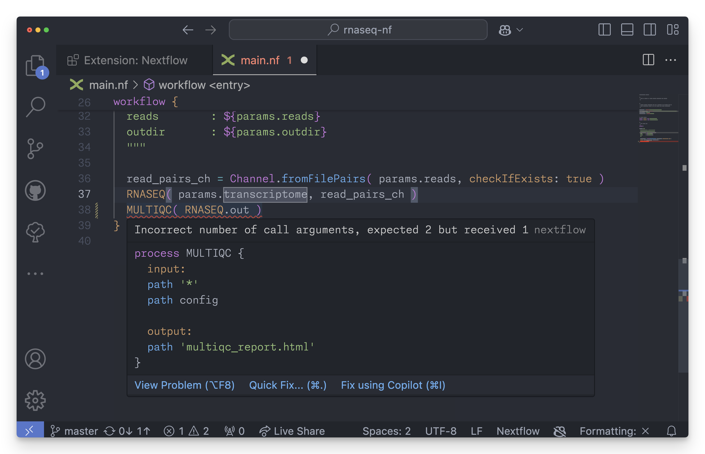

# Nextflow extension for Visual Studio Code

This extension provides [Nextflow](https://www.nextflow.io/) language support for Visual Studio Code. 

## Features

It provides syntax highlighting for the Nextflow language and quick shortcuts for common code snippets.



## Settings

The following settings are available:

- `nextflow.debug`: Enable debug logging and debug information in hover hints.

- `nextflow.harshilAlignment`: Use the [Harshil Alignment™️](https://nf-co.re/docs/contributing/code_editors_and_styling/harshil_alignment) when formatting Nextflow scripts and config files.

- `nextflow.java.home`: Specifies the folder path to the JDK. Use this setting if the extension cannot find Java automatically.

## Local development 

Clone the project repository in your computer: 

```bash
git clone https://github.com/nextflow-io/vscode-language-nextflow
```

Change in project directory and launch VS code: 

```bash
cd vscode-language-nextflow
code .
```

Hack the grammar and the snippet definition files. To quickly test changes use the `F5` key.     

## Publishing 

Update the extension version number in the `package.json` file,
then use the command: 

```bash
vsce publish
```

Read more at [this link](https://code.visualstudio.com/docs/extensions/publish-extension). 

## Contribution 

Contributions are greatly appreciated. Please fork [this repository](https://github.com/nextflow-io/vscode-language-nextflow), open a pull request to add snippets, make grammar tweaks, fix issues, etc.

## Useful links 

* https://manual.macromates.com/en/language_grammars
* https://code.visualstudio.com/docs/extensions/yocode
* https://code.visualstudio.com/docs/extensionAPI/extension-manifest
* https://marketplace.visualstudio.com/items?itemName=nextflow.nextflow

**Enjoy!**
