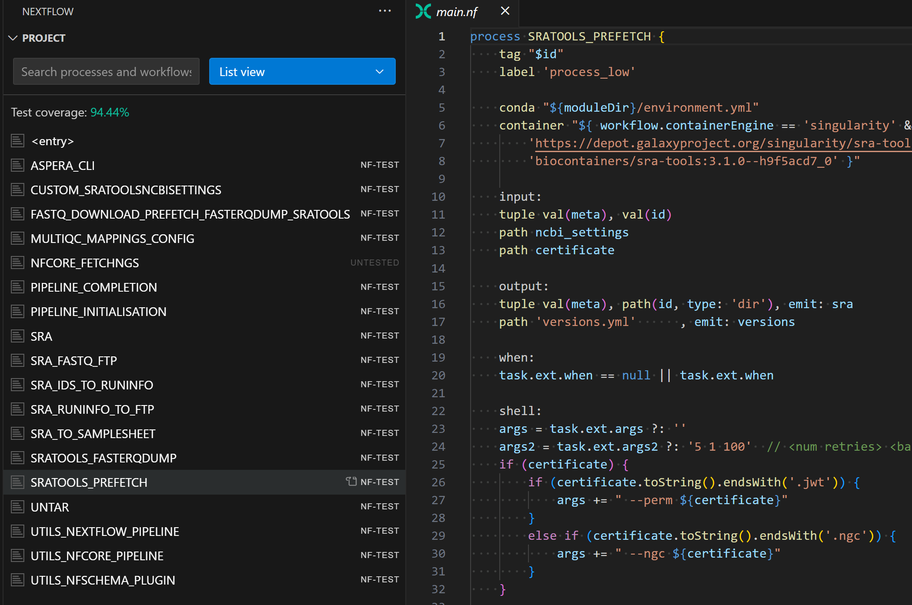
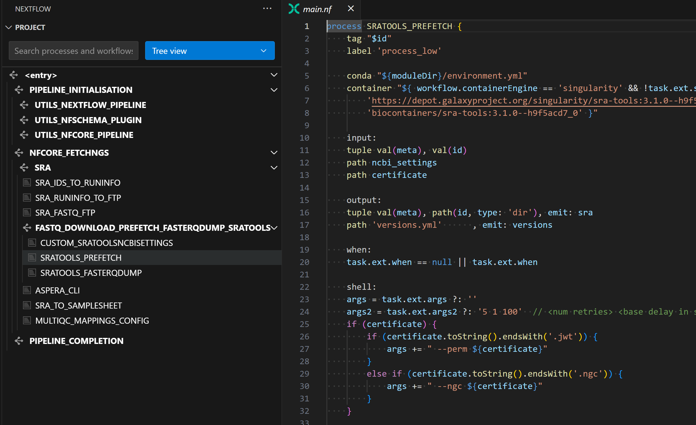

# Nextflow extension for Visual Studio Code

VS Code extension for [Nextflow](https://www.nextflow.io/) that provides language support for Nextflow scripts and config files.

## Features

### Nextflow language server


The extension uses the [Nextflow language server](https://github.com/nextflow-io/language-server) to provide code intelligence:

- Syntax highlighting
- Code navigation (outline, go to definition, find references)
- Code completion
- Diagnostics (errors, warnings)
- Formatting
- Hover hints
- Rename
- DAG preview for workflows

Read the [Nextflow documentation](https://nextflow.io/docs/latest/vscode.html) for more information about the Nextflow language server.

Related blog posts:

- [Modernizing the Nextflow Developer Experience (Part 1): The IDE](https://seqera.io/blog/modernizing-nextflow-developer-experience/)
- [Modernizing the Nextflow Developer Experience (Part 2): The Language Server](https://seqera.io/blog/modernizing-nextflow-developer-experience-part-2/)

### Copilot for Nextflow


The extension includes a GitHub Copilot extension specifically trained for Nextflow development:

- Full support for Nextflow DSL2 syntax
- Context-aware assistance that understands your specific codebase
- Generates code following Nextflow best practices and patterns
- Works with any LLM you have access to (e.g. OpenAI, Anthropic, Google) through Github Copilot (Sonnet 3.5 is recommended by the Seqera team)
- Special commands:
  - `/dsl2` - Convert DSL1 scripts to DSL2
  - `/nf-test` - Assists in generating nf-test test cases and improving test coverage

Related blog posts:

- [Bringing Seqera AI to the Nextflow VS Code extension](https://seqera.io/blog/seqera-ai--nextflow-vs-code/)

### Project view

The extension provides a custom view for Nextflow projects. The Project view uses the language server to provide an overview of your pipeline project.

The list view lists all processes and workflows, as well as any associated [nf-test](https://www.nf-test.com/) files, in alphabetical order:



The tree view shows processes and workflows organized by call hierarchy:



*Examples taken from the [nf-core/fetchngs](https://github.com/nf-core/fetchngs) pipeline.*

The Project view allows you to:

- See the structure of your pipeline
- Navigate to a process, workflow, or test by name
- Monitor test coverage across your entire pipeline

## Installation

This extension is available in the [Visual Studio Marketplace](https://marketplace.visualstudio.com/items?itemName=nextflow.nextflow) and the [Open VSX Registry](https://www.open-vsx.org/extension/nextflow/nextflow).

### Requirements

The language server requires Java 17 or later.

*Note: for custom Java installations such as conda, you might need to set the `nextflow.java.home` extension setting for the extension to find your Java installation.*

### Offline usage

The extension downloads an appropriate version of the language server from GitHub based on the `nextflow.languageVersion` extension setting. To use the language server in an offline environment, you must download a language server release manually and save it in the local cache directory used by the extension. For example:

```bash
mkdir -p ~/.nextflow/lsp/v24.10
wget https://github.com/nextflow-io/language-server/releases/download/v24.10.0/language-server-all.jar -O ~/.nextflow/lsp/v24.10/v24.10.0.jar
```

The extension will fall back to the latest patch version from the local cache if it can't download from GitHub.

*Note: Nextflow language server patch versions have no correlation to Nextflow patch versions. Always use the latest patch version of the language server when downloading a release manually.*

## Commands

Open the command palette and type `Nextflow` to see the list of available commands.

## Configuration

The following settings are available:

- `nextflow.completion.extended`: Provide auto-completions from outside the current script. If an external completion is selected, it will be automatically included into the current script.

- `nextflow.completion.maxItems`: The maximum number of auto-completions to suggest at a time.

- `nextflow.debug`: Enable debug logging and debug information in hover hints.

- `nextflow.errorReportingMode`: Set the desired level of error reporting.

- `nextflow.files.exclude`: Folders that should be excluded when scanning the workspace for Nextflow files.

- `nextflow.formatting.harshilAlignment`: Use the [Harshil Alignment™️](https://nf-co.re/docs/contributing/code_editors_and_styling/harshil_alignment) when formatting Nextflow scripts and config files.

  *Note: not all rules are supported.*

- `nextflow.formatting.maheshForm`: Place process outputs at the end of the process body when formatting Nextflow scripts.

- `nextflow.formatting.sortDeclarations`: Sort script declarations when formatting Nextflow scripts.

- `nextflow.java.home`: Specifies the folder path to the JDK. Equivalent to the `JAVA_HOME` environment variable, i.e. the Java binary should be located at `$JAVA_HOME/bin/java`. Use this setting if the extension cannot find Java automatically.

- `nextflow.languageVersion`: Nextflow language version to be used by the language server.

- `nextflow.telemetry.enabled`: Enable usage data to be sent to Seqera. See the [welcome page](./src/welcomePage/welcome-vscode.md) for more information about what we do and do not collect.

## Telemetry notice

We (Seqera) collect limited usage data through this extension to help us understand which features are most valuable and improve your overall experience.

This telemetry is opt-in and can be enabled or disabled at any time by toggling "Nextflow > Telemetry: Enabled" in your VS Code settings.

**Information we collect**

- Commands: We track when you invoke a command provided by this extension (e.g. openChat, writeTest, etc.), but not the contents of that command (e.g. user-supplied arguments).
- File events: We track when you open a Nextflow file, but not the file name or its contents.
- Environment info: We collect your operating system type, VS Code version, and the extension version to help diagnose issues and guide future development.

**Information we do not collect**

- Chat contents: We do not collect any text you enter into the chat panel.
- File contents: We do not collect any source code, file paths, or any other file contents.
- Personal info: We do not collect project names, directory paths, or any personally identifiable information.

If you have any questions or concerns, feel free to open an issue in our repository. We appreciate your trust and feedback!
