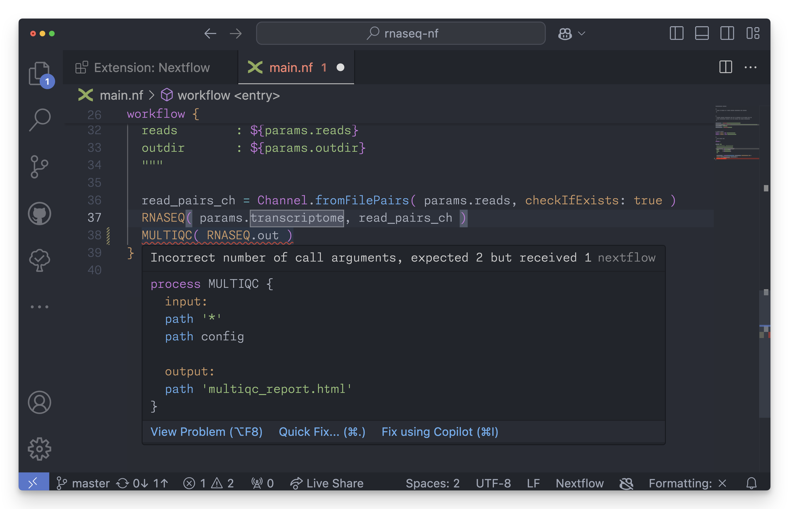
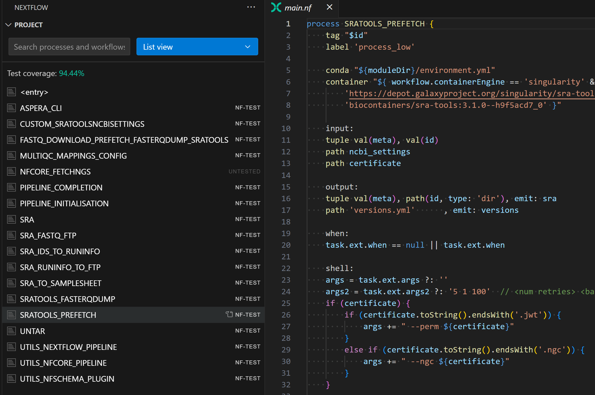
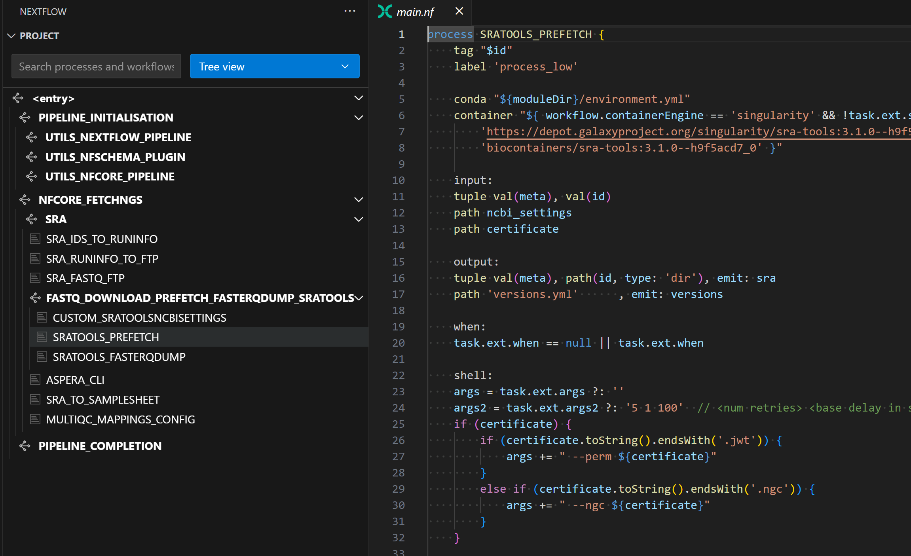
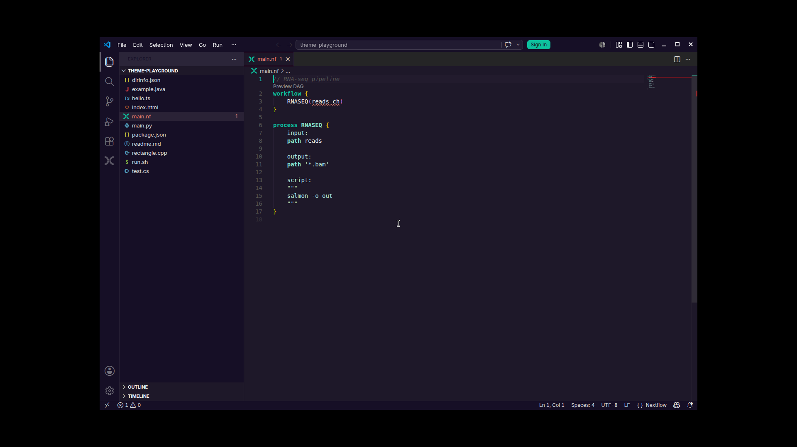

# Nextflow extension for Visual Studio Code

VS Code extension for [Nextflow](https://www.nextflow.io/) that provides language support for Nextflow scripts and config files.

## Features

### Nextflow language server



The extension uses the [Nextflow language server](https://github.com/nextflow-io/language-server) to provide code intelligence:

- Syntax highlighting
- Code navigation (outline, go to definition, find references)
- Code completion
- Diagnostics (errors, warnings)
- Formatting
- Hover hints
- Rename
- DAG preview for workflows

Read the [Nextflow documentation](https://nextflow.io/docs/latest/vscode.html) for more information about the Nextflow language server.

Related blog posts:

- [Modernizing the Nextflow Developer Experience (Part 1): The IDE](https://seqera.io/blog/modernizing-nextflow-developer-experience/)
- [Modernizing the Nextflow Developer Experience (Part 2): The Language Server](https://seqera.io/blog/modernizing-nextflow-developer-experience-part-2/)

### Project view

The extension provides a custom view for Nextflow projects. The Project view uses the language server to provide an overview of your pipeline project.

The list view lists all processes and workflows, as well as any associated [nf-test](https://www.nf-test.com/) files, in alphabetical order:



The tree view shows processes and workflows organized by call hierarchy:



_Examples taken from the [nf-core/fetchngs](https://github.com/nf-core/fetchngs) pipeline._

The Project view allows you to:

- See the structure of your pipeline
- Navigate to a process, workflow, or test by name
- Monitor test coverage across your entire pipeline

### Copilot for Nextflow

The Copilot extension for Seqera AI has been removed. Use the [Seqera AI CLI](https://seqera.io/blog/seqera-ai-cli-announcement/) instead.

### Seqera Dark theme



This extension includes bundled **Seqera Dark** and **Seqera Light** color themes aligned with Seqera and Nextflow branding. To enable one, open the Command Palette and run **Preferences: Color Theme**, then select **Seqera Dark** or **Seqera Light**.

The README preview is captured from VS Code using sample files from [vscode-theme-tester](https://github.com/microsoft/vscode-theme-tester) with Nextflow syntax highlighting. Regenerate it with `bash scripts/capture-seqera-theme-preview.sh` after packaging the extension.

The theme highlights Nextflow-specific syntax scopes (e.g. `process`, `workflow`, `params`) and log levels in `.nextflow.log` files. Webviews and the DAG preview inherit colors from the active VS Code theme via `--vscode-*` CSS variables.

Design tokens are documented in [`DESIGN.md`](DESIGN.md) using the [DESIGN.md format](https://github.com/google-labs-code/design.md).

### Seqera product icon theme

Run **Preferences: Product Icon Theme** and select **Seqera** for teal-accented workbench icons (activity bar, folding, terminal).

### Seqera file icon theme

Run **Preferences: File Icon Theme** and select **Seqera** for Nextflow-branded file icons (`.nf`, `.config`, log files). Uses VS Code-style folder/file glyphs with an embedded Nextflow logo on script files.

## Installation

This extension is available in the [Visual Studio Marketplace](https://marketplace.visualstudio.com/items?itemName=nextflow.nextflow) and the [Open VSX Registry](https://www.open-vsx.org/extension/nextflow/nextflow).

### Requirements

The language server requires Java 17 or later.

_Note: for custom Java installations such as conda, you might need to set the `nextflow.java.home` extension setting for the extension to find your Java installation._

### Offline usage

The extension downloads an appropriate version of the language server from GitHub based on the `nextflow.languageVersion` extension setting. To use the language server in an offline environment, you must download a language server release manually and save it in the local cache directory used by the extension. For example:

```bash
mkdir -p ~/.nextflow/lsp/v24.10
wget https://github.com/nextflow-io/language-server/releases/download/v24.10.0/language-server-all.jar -O ~/.nextflow/lsp/v24.10/v24.10.0.jar
```

The extension will fall back to the latest patch version from the local cache if it can't download from GitHub.

_Note: Nextflow language server patch versions have no correlation to Nextflow patch versions. Always use the latest patch version of the language server when downloading a release manually._

## Commands

Open the command palette and type `Nextflow` to see the list of available commands.

## Configuration

The following settings are available:

- `nextflow.completion.extended`: Provide auto-completions from outside the current script. If an external completion is selected, it will be automatically included into the current script.

- `nextflow.completion.maxItems`: The maximum number of auto-completions to suggest at a time.

- `nextflow.debug`: Enable debug logging and debug information in hover hints.

- `nextflow.errorReportingMode`: Set the desired level of error reporting.

- `nextflow.files.exclude`: Folders that should be excluded when scanning the workspace for Nextflow files.

- `nextflow.formatting.harshilAlignment`: Use the [Harshil Alignment™️](https://nf-co.re/docs/contributing/code_editors_and_styling/harshil_alignment) when formatting Nextflow scripts and config files.

  _Note: not all rules are supported._

- `nextflow.formatting.maheshForm`: Place process outputs at the end of the process body when formatting Nextflow scripts.

- `nextflow.formatting.sortDeclarations`: Sort script declarations when formatting Nextflow scripts.

- `nextflow.java.home`: Specify the folder path to the desired Java runtime. Equivalent to the `JAVA_HOME` environment variable, i.e. the Java binary should be located at `$JAVA_HOME/bin/java`. Use this setting if the extension cannot find Java automatically.

- `nextflow.languageVersion`: Nextflow language version to be used by the language server.

- `nextflow.log.debugOpacity`: Opacity applied to `DEBUG` and `TRACE` entries in `.nextflow.log` files. Set to `1.0` to disable dimming.

- `nextflow.log.filter.enabled`: Enable filtering by log level. Logs are read-only when filtered.

- `nextflow.log.filter.hiddenLevels`: Log levels to hide in `.nextflow.log` files when filtering is enabled. The file on disk is unchanged. Can be toggled per-file in the editor title bar.

- `nextflow.log.filter.stripAnsi`: Remove ANSI escape codes (e.g. `\u001b[0;32m`) from `.nextflow.log` files when filtering is enabled. The file on disk is unchanged. Can be toggled per-file in the editor title bar.

- `nextflow.telemetry.enabled`: Enable usage data to be sent to Seqera. See [below](#telemetry-notice) for more information about what we do and do not collect.

## Telemetry notice

We (Seqera) collect limited usage data through this extension to help us understand which features are most valuable and improve your overall experience.

This telemetry is opt-in and can be enabled or disabled at any time by toggling "Nextflow > Telemetry: Enabled" in your VS Code settings.

**Information we collect**

- Commands: We track when you invoke a command provided by this extension, but not the contents of that command (e.g. user-supplied arguments).
- File events: We track when you open a Nextflow file, but not the file name or its contents.
- Environment info: We collect your operating system type, VS Code version, and the extension version to help diagnose issues and guide future development.

**Information we do not collect**

- Chat contents: We do not collect any text you enter into the chat panel.
- File contents: We do not collect any source code, file paths, or any other file contents.
- Personal info: We do not collect project names, directory paths, or any personally identifiable information.

If you have any questions or concerns, feel free to open an issue in our repository. We appreciate your trust and feedback!
